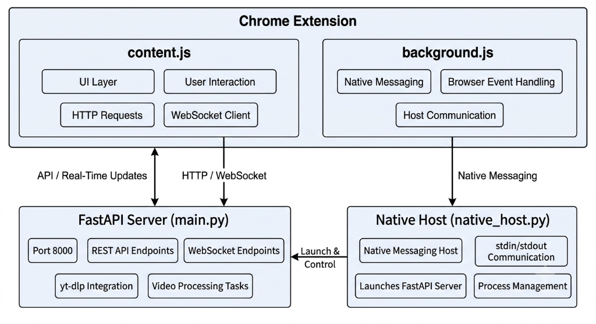

<p align="center">
  
  
  
  
</p>

<h1 align="center">PokéDex Downloader</h1>

<p align="center">
  <strong>A Pokémon-themed Chrome extension that wraps <code>yt-dlp</code> into a clean, animated UI — directly on YouTube.</strong>
</p>

<p align="center">
  Click the Pokéball → pick your format → throw it → catch the video.
</p>

<p align="center">
  
</p>

---

## Overview

PokéDex Downloader injects a floating Pokéball button on every YouTube watch page. Clicking it opens a themed modal where you can select video and audio streams, choose a save directory, and download — all powered by your local `yt-dlp` installation through a lightweight FastAPI backend.

**Key highlights:**

- **Pokéball UI** with throw animations, wiggle effects, and "caught" glow states
- **Granular format selection** — combined, video-only, or audio-only streams with full codec & size info
- **Real-time progress** via WebSocket — the ball wiggles faster as the download approaches completion
- **Offline-aware** — caches download state in `localStorage` so the green glow persists even when the server is off
- **Auto-start server** — uses Chrome Native Messaging to silently launch the backend on first use
- **Auto-shutdown** — server self-terminates after 2 minutes of inactivity
- **Native file actions** — open downloaded files or reveal them in Explorer without the server running

---

## Architecture

<p align="center">
  
</p>

---

## Security

To secure your local machine from unauthorized web access:
- **Chrome Native Messaging Bounds**: The native host configuration (`com.ytdlp.server.json`) restricts execution and communication access strictly to your specific Chrome Extension ID.
- **Dynamic Token Authentication**: When the extension starts the FastAPI server, it generates a cryptographically secure API token. All subsequent HTTP requests must include this token in the `X-API-Token` header, and WebSocket connections must pass it in the `token` query parameter.
- **Protected Endpoints**: System-exposing endpoints (like `/formats`, `/check`, `/browse`, `/open`, `/reveal`) will immediately reject unauthorized requests with `403 Forbidden`. Only the lightweight `/ping` health check endpoint remains publicly open.

---

## Prerequisites

| Requirement | Notes |
|---|---|
| **Windows 10/11** | Native Messaging and VBS scripts are Windows-specific |
| **Python 3.9+** | For the FastAPI backend |
| **yt-dlp** | Must be on your system `PATH` — [install guide](https://github.com/yt-dlp/yt-dlp#installation) |
| **ffmpeg** | Required by yt-dlp for merging video+audio — [download](https://ffmpeg.org/download.html) |
| **Google Chrome** | Manifest V3 extension |

---

## Installation

### 1 — Clone the repository

```bash
git clone https://github.com/<your-username>/yt_dlp_extension.git
cd yt_dlp_extension
```

### 2 — Set up the Python backend

```bash
cd server
python -m venv venv
venv\Scripts\activate
pip install -r requirements.txt
```

### 3 — Load the Chrome extension

1. Open Chrome → navigate to `chrome://extensions`
2. Enable **Developer mode** (top-right toggle)
3. Click **Load unpacked** → select the `extension/` folder
4. Note the **Extension ID** displayed under the extension name

### 4 — Register Native Messaging

Open `server/install_protocol.bat` and update the `EXT_ID` variable on **line 21** with your Extension ID, then run it:

```bash
cd server
install_protocol.bat
```

This registers the native messaging host in the Windows registry so Chrome can silently launch the server.

### 5 — Restart Chrome

Close and reopen Chrome. The extension is ready.

---

## Usage

1. Navigate to any YouTube video
2. Click the **Pokéball** button (bottom-right corner)
3. The modal opens — formats are fetched automatically (server starts silently if needed)
4. Select your **video stream** and **audio stream**
5. Set your **save directory** (persisted across sessions)
6. Click **THROW POKÉBALL (DL)**
7. Watch the capture animation — the ball wiggles until the download completes
8. The Pokéball glows **green** on videos you've already downloaded

### Already Downloaded?

If a video is already in your save directory, the modal shows an **"Already in Box"** panel with:

- **▶ Play File** — opens the file with your default media player
- **📂 Show in Folder** — reveals it in Windows Explorer

Both actions work via Native Messaging — no server required.

---

## Project Structure

```
yt_dlp_extension/
├── extension/
│   ├── manifest.json        # Chrome MV3 manifest
│   ├── background.js        # Service worker (Native Messaging bridge)
│   ├── content.js           # UI injection, format selection, download logic
│   └── content.css          # Pokédex-themed styles and animations
│
├── server/
│   ├── main.py              # FastAPI backend (formats, download, browse)
│   ├── native_host.py       # Chrome Native Messaging host (file ops)
│   ├── native_host.bat      # Batch wrapper for native_host.py
│   ├── requirements.txt     # Python dependencies
│   ├── install_protocol.bat # One-time setup: registers native messaging
│   ├── start_background.bat # Manual server start (hidden window)
│   ├── start_server.vbs     # VBS launcher (no console flash)
│   └── stop_background.bat  # Finds and kills the server process
│
├── .gitignore
└── README.md
```

---

## API Reference

The FastAPI server exposes the following endpoints on `http://127.0.0.1:8000`:

| Method | Endpoint | Description |
|---|---|---|
| `GET` | `/formats?url=<youtube_url>` | Returns categorized format list (combined, video-only, audio-only) |
| `GET` | `/check?v=<video_id>&save_dir=<path>` | Checks if a video is already downloaded in the given directory |
| `GET` | `/browse` | Opens a native folder picker dialog and returns the selected path |
| `GET` | `/open?save_dir=<path>&filename=<name>` | Opens a file with the OS default application |
| `GET` | `/reveal?save_dir=<path>&filename=<name>` | Opens Explorer with the file selected |
| `GET` | `/ping` | Health check — returns `{"status": "alive"}` |
| `POST` | `/shutdown` | Gracefully terminates the server |
| `WS` | `/ws/download` | WebSocket endpoint for real-time download progress |

---

## Configuration

| Setting | Location | Default | Description |
|---|---|---|---|
| Idle timeout | `server/main.py` line 16 | `120` seconds | Server auto-shuts down after this duration of inactivity |
| Save directory | Extension UI | — | Persisted in `localStorage` per browser profile |
| Server port | `server/main.py` line 232 | `8000` | Change here **and** in `extension/manifest.json` `host_permissions` |

---

## Troubleshooting

| Symptom | Cause | Fix |
|---|---|---|
| Pokéball doesn't appear | Not on a `/watch` page, or extension disabled | Check `chrome://extensions` — ensure it's enabled |
| "Could not connect to server" | Server didn't start | Run `server/start_background.bat` manually |
| "Native host disconnected" | Native messaging not registered | Re-run `server/install_protocol.bat` with the correct Extension ID |
| Download fails with merge error | ffmpeg not installed or not on PATH | Install ffmpeg and ensure `ffmpeg --version` works in terminal |
| Green glow doesn't appear | Save directory changed or file renamed | The check matches `[video_id]` in the filename — don't rename downloads |

---

## Support

If this free tool saves you time, consider supporting future development:

[](https://ko-fi.com/Yogeshvar425)

---

## License

This project is licensed under the [MIT License](LICENSE).
